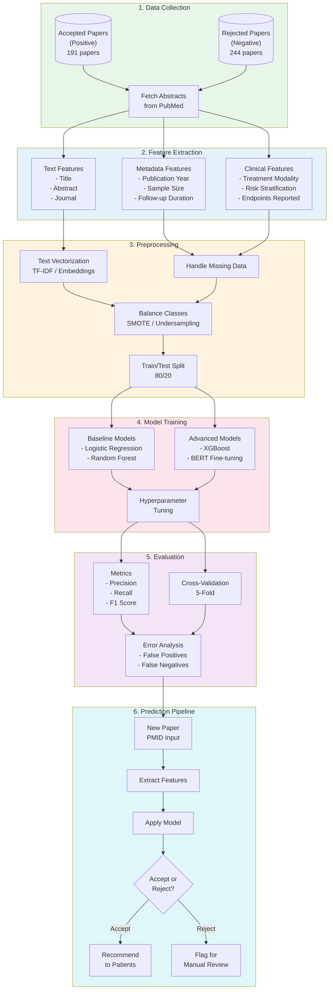

# ML Workflow for Paper Classification

This diagram shows the high-level steps to build a machine learning model that predicts whether a prostate cancer research paper should be recommended to patients based on the [inclusion criteria](../../inclusion-criteria.md) and [exclusion criteria](../../exclusion-criteria.md).

## Workflow Overview

## Inclusion Criteria Features

The model learns to identify papers that meet these criteria:

| Criterion | Feature Extraction Method |
|-----------|---------------------------|
| **Treatment Modality** | Keyword matching for 19 treatment types (prostatectomy, EBRT, brachytherapy, etc.) |
| **Risk Stratification** | Detection of D'Amico, NCCN, or Zelefsky classification mentions |
| **Proper Endpoints** | Keywords: BRFS, OS, MFS, CSS, biochemical recurrence |
| **EBRT Dose ≥72Gy** | Regex extraction of radiation dose values |
| **Sample Size** | Regex extraction: n=X, X patients, cohort of X |
| **Follow-up ≥5 years** | Regex extraction of median follow-up duration |
| **Peer Reviewed** | Journal name matching against known peer-reviewed journals |

## Exclusion Criteria Detection

Papers are flagged for rejection if they contain:

| Exclusion Reason | Detection Method |
|------------------|------------------|
| No risk stratification | Absence of D'Amico/NCCN/Zelefsky terms |
| Missing endpoints | No BRFS/OS/MFS/CSS mentions |
| Pathologic staging only | Keywords: "pathologic staging", "surgical staging" |
| Low EBRT dose | Extracted dose < 72Gy |
| Insufficient patients | Extracted n < 100 (low/int) or n < 50 (high risk) |
| Short follow-up | Extracted follow-up < 5 years |
| Not peer reviewed | Conference abstract, poster, presentation keywords |

## Model Performance Targets

| Metric | Target | Rationale |
|--------|--------|-----------|
| **Recall** | ≥95% | Don't miss good papers for patients |
| **Precision** | ≥80% | Minimize manual review burden |
| **F1 Score** | ≥85% | Balanced performance |

## Known Challenges

1. **Temporal Bias**: Positive papers (1999-2013) vs negative (2005-2022) - see [Year Distribution Report](../../reports/data-profiles/year-distribution.md)
2. **Class Imbalance**: 191 positive vs 244 negative papers
3. **Missing Abstracts**: Some papers lack abstracts in PubMed
4. **Implicit Criteria**: Some acceptance decisions may involve domain expertise not captured in text
