# Fine-Tuning PubMedBERT

This page shows the planned workflow for turning the positive and negative datasets in `data/` into a fine-tuned [PubMedBERT](../pubmedbert.md) classifier. The model predicts whether a paper's abstract meets our [selection criteria](../selection-criteria.md).

!!! note
    The data preparation steps (blue) already exist as scripts in `src/`. The training, evaluation, and inference steps (green) are planned, and no fine-tuning script exists yet.

## Workflow Diagram

```mermaid
flowchart TD
    subgraph SRC["1. Source Data (data/)"]
        direction TB
        X1["positive-data-set.xlsx<br/>PMIDs grouped by risk category<br/>140 rows, 120 unique PMIDs"]
        X2["negative-data-set.xlsx<br/>244 papers on 4 sheets<br/>2005, 2010, 2015, 2020"]
    end

    subgraph FETCH["2. Fetch Abstracts and Metadata"]
        direction TB
        F1["build-positive-dataset.py<br/>NCBI E-utilities, 0.34s rate limit"]
        F2["positive-data-set.json<br/>120 papers with abstracts"]
        F3["negative-data-set.json<br/>244 papers, 243 with abstracts"]
        F1 --> F2
    end

    subgraph MERGE["3. Merge and Label"]
        direction TB
        M1["build-labeled-dataset.py"]
        M2["labeled-dataset.csv<br/>364 rows<br/>label: 1 = positive, 0 = negative"]
        M1 --> M2
    end

    subgraph CLEAN["4. Clean and Validate"]
        direction TB
        C1{"PMID in both sets?"}
        C2["Resolve label conflict manually<br/>PMID 15774239 is in both sets"]
        C3{"Abstract missing<br/>or empty?"}
        C4["Drop row<br/>1 negative paper has no abstract"]
        C5["Build model input text<br/>title + abstract"]
        C1 -- "yes" --> C2
        C1 -- "no" --> C3
        C2 --> C3
        C3 -- "yes" --> C4
        C3 -- "no" --> C5
    end

    subgraph SPLIT["5. Split Data"]
        direction TB
        S1["Stratified split<br/>on label + risk_category"]
        S2["Train 70%"]
        S3["Validation 15%<br/>early stopping and tuning"]
        S4["Test 15%<br/>touched once at the end"]
        S1 --> S2
        S1 --> S3
        S1 --> S4
    end

    subgraph TOK["6. Tokenize"]
        direction TB
        T1["AutoTokenizer<br/>BiomedNLP-BiomedBERT-base-uncased-abstract"]
        T2["Truncate to 512 tokens<br/>Pad per batch<br/>Add attention masks"]
        T1 --> T2
    end

    subgraph TRAIN["7. Fine-Tune"]
        direction TB
        R1["Load pretrained encoder<br/>BertForSequenceClassification<br/>num_labels = 2"]
        R2["Handle class imbalance<br/>120 positive vs 244 negative<br/>class-weighted cross-entropy"]
        R3["Train<br/>lr 2e-5, batch 16, 3 to 5 epochs<br/>warmup + weight decay"]
        R4["Evaluate on validation set<br/>each epoch"]
        R5{"Validation F1<br/>still improving?"}
        R6["Keep best checkpoint"]
        R1 --> R2 --> R3 --> R4 --> R5
        R5 -- "yes" --> R3
        R5 -- "no" --> R6
    end

    subgraph EVAL["8. Evaluate"]
        direction TB
        E1["Score held-out test set"]
        E2["Precision, recall, F1, AUROC<br/>confusion matrix"]
        E3["Compare against baselines<br/>TF-IDF + Logistic Regression<br/>rule-based scorer"]
        E4["Error analysis<br/>by risk category and year group"]
        E5{"Beats baselines<br/>and meets target?"}
        E1 --> E2 --> E3 --> E4 --> E5
    end

    subgraph DEPLOY["9. Save and Apply"]
        direction TB
        D1["Save model + tokenizer<br/>models/pubmedbert-prostate/"]
        D2["Score filtered-candidates.csv<br/>4,211 unlabeled papers"]
        D3["Rank by predicted probability"]
        D4["Manual review of<br/>uncertain middle band"]
        D5["Add reviewed papers<br/>to the labeled dataset"]
        D1 --> D2 --> D3 --> D4 --> D5
    end

    X1 --> F1
    X2 --> F3
    F2 --> M1
    F3 --> M1
    M2 --> C1
    C5 --> S1
    S2 --> T1
    S3 --> T1
    S4 --> T1
    T2 --> R1
    R6 --> E1
    E5 -- "yes" --> D1
    E5 -- "no" --> R2
    D5 -. "retrain with more data" .-> M1

    classDef exists fill:#dbeafe,stroke:#2563eb,color:#1e3a8a
    classDef planned fill:#dcfce7,stroke:#16a34a,color:#14532d
    classDef decision fill:#fef9c3,stroke:#ca8a04,color:#713f12
    class X1,X2,F1,F2,F3,M1,M2 exists
    class C2,C4,C5,S1,S2,S3,S4,T1,T2,R1,R2,R3,R4,R6,E1,E2,E3,E4,D1,D2,D3,D4,D5 planned
    class C1,C3,R5,E5 decision
```



## Step Details

| Step | Purpose | Notes |
|---|---|---|
| 1. Source data | Hand-curated examples of accepted (positive) and rejected (negative) papers | Positive papers are grouped under LOW, INTERMEDIATE, and HIGH RISK headers |
| 2. Fetch | Pull abstracts and metadata from PubMed | Requires an email address for the NCBI API (`--email`) |
| 3. Merge and label | Combine both sets into one table | `labeled-dataset.csv` is the intended training input |
| 4. Clean | Remove label conflicts and empty abstracts | PMID `15774239` appears in both sets, so resolve it before training |
| 5. Split | Hold out validation and test data | Stratify so each split keeps the same class ratio and risk mix |
| 6. Tokenize | Convert text to token IDs | Use the model's own tokenizer, not a generic BERT one |
| 7. Fine-tune | Train a classification head and adapt the encoder | The class weights offset the roughly 1 to 2 positive-to-negative ratio |
| 8. Evaluate | Measure real performance | Report results per risk category and year group, since the negatives span 2005 to 2020 |
| 9. Save and apply | Use the model to rank unlabeled candidates | Human review of uncertain papers feeds the next round of training |

## Design Considerations

- **Small dataset.** With 364 labeled papers, one random split gives noisy estimates. Consider stratified k-fold cross-validation (5 folds) for the final numbers, and keep a separate test set that is never used for tuning.
- **Possible leakage from year.** The negative papers are sampled from specific years (2005, 2010, 2015, 2020). If the positives are distributed differently by year, the model could learn publication year instead of study quality. Check the `year_group` column against the label before trusting the results.
- **Long abstracts.** Some abstracts exceed 512 tokens. Truncation is the simplest option. Check how many are affected before deciding on a sliding-window approach.
- **Compare against the baselines.** The fine-tuned model is only worth adopting if it beats the TF-IDF plus Logistic Regression model and the rule-based scorer. See the [baseline model report](../reports/baseline-model-report.md).
- **Weak labels.** Scores from `prostate-cancer-scorer.py` on `filtered-candidates.csv` can propose extra training examples. Validate them against a hand-labeled sample first.
- **Compute.** A base-size model on about 250 training examples fine-tunes in minutes on a laptop GPU or Apple Silicon (MPS) and in a reasonable time on CPU.

## Suggested Libraries

```sh
pip install torch transformers datasets evaluate accelerate scikit-learn
```
